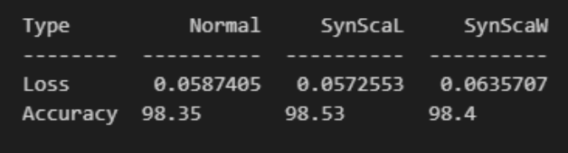
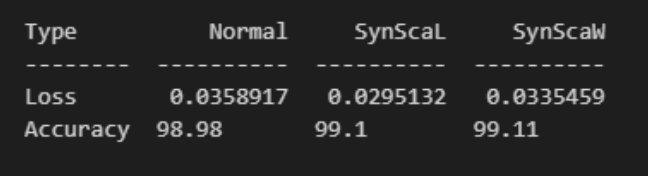
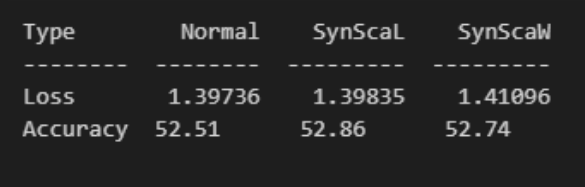
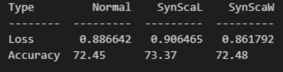
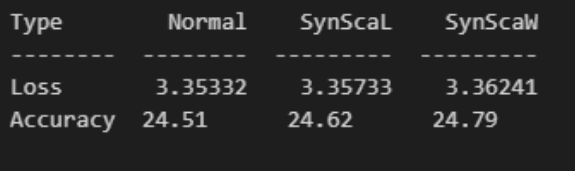
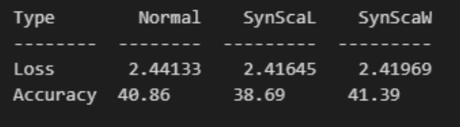

## Description
This repository hosts a Python implementation of the Synaptic scaling paper, a new Regulization method in working with deep neural networks.

## Synaptic scaling
 Nature has always inspired the human spirit and scientists frequently developed new methods based on observations from nature. Recent advances in imaging and sensing technology allow fascinating insights into biological neural processes. With the objective of finding new strategies to enhance the learning capabilities of neural networks, we focus on a phenomenon that is closely related to learning tasks and neural stability in biological neural networks, called homeostatic plasticity. Among the theories that have been developed to describe homeostatic plasticity, synaptic scaling has been found to be the most mature and applicable. We systematically discuss previous studies on the synaptic scaling theory and how they could be applied to artificial neural networks. Therefore, we utilize information theory to analytically evaluate how mutual information is affected by synaptic scaling. Based on these analytic findings, we propose two flavors in which synaptic scaling can be applied in the training process of simple and complex, feedforward, and recurrent neural networks. 

## Requirements
The code is implemented in Python 3.12.10 and has been tested on Windows 10 without encountering any issues. Below are the non-standard libraries and their corresponding versions used in writing the code:
<pre>
matplotlib==3.5.1
numpy==1.22.0
torch==2.0.1+cu118
</pre>

## Usage
The network weights for each each algorithm is stored in Models folder, we implemented the desired Regulization for both mlp and resnet model variation for both synscal and synscaw. we saved weights for both best accuracy and least loss. 

## Showcase
You can view the training procedure through the following Images, demonstrating the learned process across episodes. after that we an review Results of each training.

| MNIST MLP| MNIST RESNET34|
|:-:|:-:|

| CIFAR10 MLP| CIFAR10 RESNET34|
|:-:|:-:|

| CIFAR100 MLP| CIFAR100 RESNET34|
|:-:|:-:|

